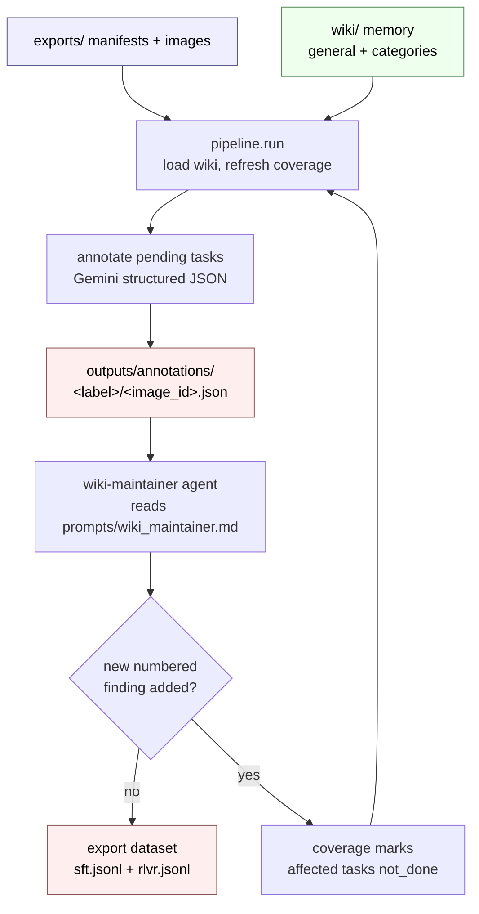

# Triage CoT Labeling

Autonomous dense-CoT annotation pipeline for triage imagery.

The repository uses a markdown wiki as persistent LLM memory. Gemini annotates
one image/category task at a time, producing compact JSON with a dense natural
CoT. A separate wiki-maintainer agent reviews completed annotations between
rounds and appends reusable numbered findings when there is new guidance.

The wiki is loaded once per annotation round. Every task in that round receives
the same wiki state in its prompt. If the maintainer changes the wiki after
the round by adding numbered findings, `wiki/coverage/coverage.csv` marks
affected tasks as `not_done` so the next round re-annotates them with the new
memory.

Setup, commands, and file-layout examples are below. For deeper operational
detail (coverage semantics, maintainer application rules, annotation contract),
see [INSTRUCTIONS.md](INSTRUCTIONS.md) and [AGENTS.md](AGENTS.md).

## Workflow



The loop continues only when the wiki-maintainer adds new numbered findings.
Editing the text of an existing finding does not create a new coverage column.

## Inputs

The pipeline reads tasks from `exports/` using this layout:

```text
exports/
└── <label>-data-vf/
    ├── yes/<image_id>.jpg
    └── no/<image_id>.jpg
```

`selection_manifest.json` per category:

```json
{
  "classification_name": "amputation_arm",
  "title": "Arm Amputation",
  "question": "Does the subject ...?",
  "selected": {
    "Yes": ["yes/0052_frame.jpg", "..."],
    "No": ["no/0188_frame.jpg", "..."]
  }
}
```

`pipeline.manifest` resolves each image as `exports/<label>-data-vf/<gt_answer>/<filename>`,
where `<gt_answer>` is `yes` or `no`.

## Run

Run commands from the repository root. The examples below use `uv`.
Note: You should have uv installed and path configured correctly.

```bash
uv sync
export GEMINI_API_KEY=...
export GEMINI_MODEL=gemini-3.1-pro-preview

uv run python -m pipeline.run
```

`pipeline.run` uses Gemini for both annotation and round-boundary wiki
maintenance. The maintainer call is text-only: Gemini proposes new findings as
JSON using `prompts/wiki_maintainer_schema.json`, and the pipeline applies those
findings to markdown deterministically. The default round budget is
`--max-rounds 3`; the loop usually exits earlier when the maintainer returns no
new findings.

## Maintainer Agent

After each annotation round, Gemini reviews the new annotations against the
existing wiki. It returns either new reusable findings or an empty list. The
pipeline appends accepted findings under `## Agent Findings`, writes
`wiki/log.md`, regenerates `wiki/index.md`, and refreshes `coverage.csv`.
Duplicate-detection and heading rules are in [INSTRUCTIONS.md](INSTRUCTIONS.md).

Resume the same labeling project by keeping `wiki/coverage/coverage.csv`.
Start an independent fresh run with a newly rebuilt sheet:

```bash
uv run python -m pipeline.run --fresh-coverage
```

Small annotation-only debug run:

```bash
uv run python -m pipeline.run --label amputation_arm --limit 4 --max-rounds 1 --skip-wiki-maintainer
```

## Bounding Boxes

The pipeline reads ground truth bounding boxes directly at runtime from `bbox_map.json` in the repository root. The model uses these coordinates to focus its spatial reasoning.

`bbox_map.json` should map the relative image path to its bounding box `[x1, y1, x2, y2]` and image dimensions. 

```json
{
  "images/0052_frame.jpg": {
    "bbox": [100, 150, 400, 450],
    "img_w": 1920,
    "img_h": 1080
  }
}
```

## Visualizing the Wiki and Annotations in Obsidian

Since annotations are stored as JSON files, they cannot be natively viewed alongside images in Obsidian. We provide two tools for visualization:

**1. Annotation Review (`review.md`)**
```bash
uv run python -m pipeline.visualize
```
This generates `outputs/review.md`. Open this file in Obsidian to scroll through all annotations grouped by category, with the generated Chain-of-Thought appearing directly below the corresponding image.

**2. Wiki Memory Graph Vault (`outputs/wiki_graph_vault/`)**
```bash
uv run python -m pipeline.wiki_graph_vault
```
This generates a dedicated folder at `outputs/wiki_graph_vault/`. Open this specific folder as a Vault in Obsidian and click "Graph View" to see a native, interactive web of the entire wiki memory structure, showing how General pages and Categories connect to their specific numbered findings.

## Repository Map

```text
CoT_labeling/
├── AGENTS.md        # operating schema for annotation and wiki maintenance
├── INSTRUCTIONS.md  # operational guidance
├── exports/         # input manifests and images
├── prompts/         # annotation prompt, output schema, maintainer prompt
├── reference/       # source material for wiki authoring
├── wiki/            # persistent LLM memory and generated coverage sheet
├── pipeline/        # executable pipeline code
└── outputs/         # generated annotations and dataset exports
```

## Core Files

- `pipeline.run`: main autonomous loop.
- `pipeline.annotate`: Gemini annotation worker, schema, JSON parser, validator.
- `pipeline.coverage`: updates the Sheets-style coverage matrix.
- `pipeline.wiki`: loads prompt files, reads wiki pages, extracts numbered
  findings, runs the Gemini maintainer pass, applies findings, and regenerates
  the wiki index.
- `pipeline.manifest`: reads task manifests from `exports/`.
- `pipeline.export`: writes SFT/RLVR JSONL files after coverage is clean.
- `pipeline.visualize`: generates an Obsidian-friendly `review.md` from annotations.
- `pipeline.wiki_graph_vault`: generates an Obsidian vault of the wiki memory graph.
- `pipeline.paths`: central filesystem layout.
- `pipeline.gemini`: minimal Gemini API wrapper.

## Outputs

`outputs/annotations/` is the canonical annotation store:

```text
outputs/annotations/<label>/<image_id>.json
```

Each file is one image/category task.

`outputs/dataset/` is derived from annotations only after coverage is clean.
The exporter splits by annotation difficulty: `easy` rows go to `sft.jsonl` and
`hard` rows go to `rlvr.jsonl`. Each row is one task:

```json
{
  "image": "exports/.../0052_frame.jpg",
  "task_id": "amputation_arm__0052_frame",
  "image_id": "0052_frame",
  "label": "amputation_arm",
  "question": "Does the subject ...?",
  "answer": "yes",
  "cot": "Dense natural visual reasoning...",
  "subject_bbox": [100, 150, 400, 450],
  "modality": "rgb",
  "difficulty": "easy"
}
```

## Annotation Shape

Each saved annotation is intentionally small:

```json
{
  "image_id": "0052_frame",
  "image_path": "exports/.../0052_frame.jpg",
  "label": "amputation_arm",
  "question": "Does the subject ...?",
  "gt_answer": "yes",
  "subject_bbox": [100, 150, 400, 450],
  "modality": "rgb",
  "difficulty": "hard",
  "cot": "Dense natural visual reasoning..."
}
```

`task_id` is derived internally as `label + "__" + image_id` for coverage rows
and task-safe output paths.

Gemini's required output fields are defined in
`prompts/annotation_schema.json`. The pipeline natively handles absolute pixel bounding boxes extracted from `bbox_map.json`.
